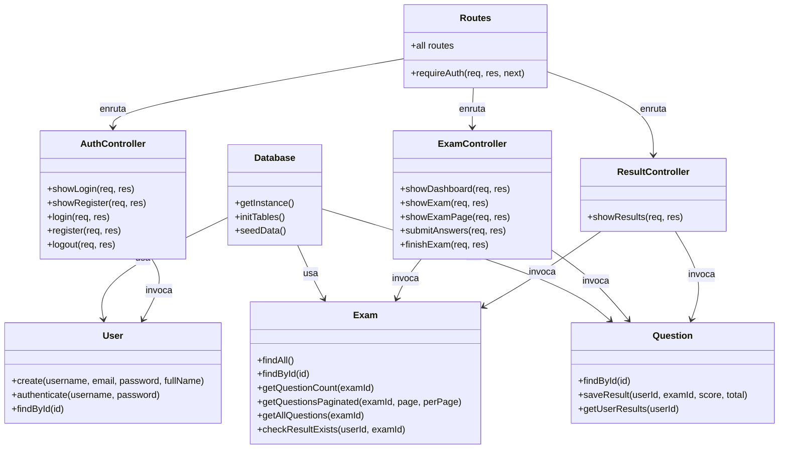

# Diagrama UML - Sistema de Examenes en Linea

## Diagrama de Clases

```
┌──────────────────────────────────────────────────────────────┐
│                        PATRON MVC                            │
├────────────────┬──────────────────┬──────────────────────────┤
│   MODELO       │   CONTROLADOR    │       VISTA              │
├────────────────┼──────────────────┼──────────────────────────┤
│ Database       │ authController   │ layouts/main.ejs         │
│ -getInstance() │ -showLogin()     │ login.ejs                │
│ -initTables()  │ -login()         │ register.ejs             │
│ -seedData()    │ -register()      │ dashboard.ejs            │
│                │ -logout()        │ exam.ejs                 │
├────────────────┼──────────────────┼──────────────────────────┤
│ User           │ examController   │ results.ejs              │
│ -create()      │ -showDashboard() │ 404.ejs                  │
│ -authenticate()│ -showExam()      │ partials/*               │
│ -findById()    │ -submitAnswers() │                          │
│                │ -finishExam()    │                          │
├────────────────┼──────────────────┼──────────────────────────┤
│ Exam           │ resultController │ public/css/style.css     │
│ -findAll()     │ -showResults()   │ public/js/keyboard-nav.js│
│ -findById()    │                  │                          │
│ -getQuestions()│                  │                          │
├────────────────┼──────────────────┼──────────────────────────┤
│ Question       │                  │                          │
│ -findById()    │                  │                          │
│ -saveResult()  │                  │                          │
│ -getResults()  │                  │                          │
└────────────────┴──────────────────┴──────────────────────────┘
```

## Diagrama de Clases (Mermaid)



## Diagrama de Casos de Uso

```
                    ┌─────────────────────────┐
                    │  Sistema de Examenes     │
                    │       en Linea           │
                    │                          │
   ┌────────────┐   │  ┌──────────────────┐   │   ┌────────────┐
   │            │   │  │  Iniciar Sesion  │   │   │            │
   │ Estudiante │───┼──│  (include)       │   │   │            │
   │            │   │  └──────────────────┘   │   │            │
   │            │   │  ┌──────────────────┐   │   │            │
   │            │───┼──│  Crear Cuenta    │   │   │            │
   │            │   │  └──────────────────┘   │   │            │
   │            │   │  ┌──────────────────┐   │   │            │
   │            │───┼──│ Ver Panel        │   │   │            │
   │            │   │  │ de Examenes      │   │   │            │
   │            │   │  └──────────────────┘   │   │            │
   │            │   │  ┌──────────────────┐   │   │            │
   │            │───┼──│ Realizar Examen  │   │   │            │
   │            │   │  │ (paginado 5±2)   │   │   │            │
   │            │   │  └──────────────────┘   │   │            │
   │            │   │  ┌──────────────────┐   │   │            │
   │            │───┼──│ Ver Resultados   │   │   │            │
   │            │   │  └──────────────────┘   │   │            │
   └────────────┘   └─────────────────────────┘   └────────────┘
```

## Relaciones entre Tablas (Base de Datos)

```
users (1) ────────< (N) results >──────── (1) exams
                                              │
                                              │ (1)
                                              │
                                              ▼ (N)
                                         questions
```

## Flujo de Interaccion

```
Usuario → login.ejs → authController → User.authenticate → Dashboard
                                                            │
                                                            ▼
                                                    examController → Exam.getQuestionsPaginated
                                                            │
                                                            ▼
                                                      exam.ejs (paginado)
                                                            │
                                                            ▼
                                                    submitAnswers → finishExam
                                                            │
                                                            ▼
                                                    Question.saveResult → results.ejs
```
